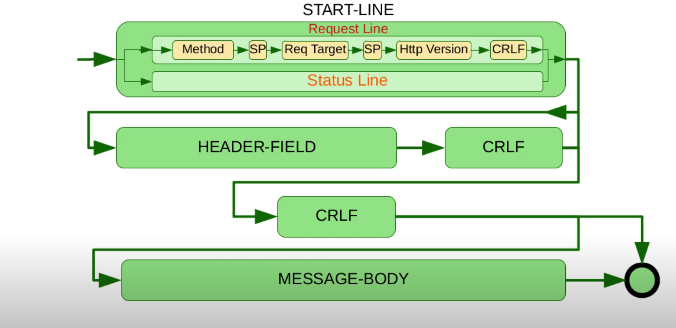

# Custom HTTP Server in Java

*Figure 1: Diagram of HTTP Message Structure*

This project is a custom implementation of an HTTP/1.1 server using Java, designed to handle basic HTTP methods like `GET` and `HEAD`, and parse HTTP messages as defined in the HTTP/1.1 specification (RFC 7230).

---

## 📜 HTTP/1.1 Message Structure

HTTP-message = start-line *( header-field CRLF ) CRLF
[ message-body ]

start-line = request-line / status-line

request-line = method SP request-target SP HTTP-version CRLF

---

## 📌 Supported Methods

| Method | Description                                            | Sec.   |
|--------|--------------------------------------------------------|--------|
| GET    | Transfer a current representation of the target resource. | 4.3.1 |
| HEAD   | Same as GET, but only transfer the status line and header section. | 4.3.2 |

- All general-purpose servers **MUST** support the methods `GET` and `HEAD`.
- All other methods are **OPTIONAL**.

---

## 🚫 Error Handling

- **501 Not Implemented**: If the server receives a method it does not recognize.
- **405 Method Not Allowed**: If the server knows the method but it's not allowed for the target resource.

---

## 📖 Reference

- RFC 7230 - [Hypertext Transfer Protocol (HTTP/1.1): Message Syntax and Routing](https://tools.ietf.org/html/rfc7230)

---

## 🧠 Notes

- The `method` token is **case-sensitive**.
- The allowed methods for a resource can be listed using the `Allow` header.
- HTTP was designed as an interface to distributed object systems, hence the method tokens.

---

Feel free to contribute or suggest enhancements!
